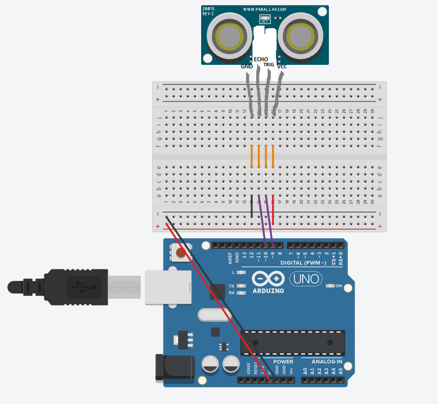

# README

## Sensor de Distância Ultrassônico

Este repositório contém um esboço (sketch) Arduino para utilizar um sensor de distância ultrassônico. O código calcula a distância de um objeto em relação ao sensor e exibe o resultado através do monitor serial.

### Componentes Utilizados

- **Sensor de Distância Ultrassônico HC-SR04**: O código foi projetado para funcionar com um sensor de distância ultrassônico. Certifique-se de que o sensor está conectado aos pinos corretos da sua placa Arduino.

### Configuração dos Pinos

- **trigPin**: Número do pino para o pino de trigger (disparo) do sensor ultrassônico. Neste código, está configurado como pino 9.
- **echoPin**: Número do pino para o pino de eco do sensor ultrassônico. Neste código, está configurado como pino 10.

### Instalação e Configuração

1. Conecte o sensor de distância ultrassônico à sua placa Arduino conforme a configuração dos pinos mencionada acima.
2. Carregue o esboço (sketch) Arduino fornecido na sua placa Arduino.
3. Abra o monitor serial para visualizar as medições de distância.

### Como o Código Funciona

- Na função `setup()`:
  - Os pinos para o trigger e echo do sensor ultrassônico são definidos como SAÍDA e ENTRADA, respectivamente.
  - A comunicação serial é inicializada com uma taxa de transmissão (baud rate) de 9600.

- Na função `loop()`:
  - Um pulso de disparo é enviado para o sensor ultrassônico.
  - O tempo necessário para o pulso retornar (eco) é medido usando a função `pulseIn()`.
  - A duração é convertida em distância usando a velocidade do som.
  - A distância é então impressa no monitor serial.

### Observação

- Certifique-se de que o seu sensor ultrassônico está corretamente conectado à placa Arduino.
- Ajuste a taxa de transmissão (baud rate) do monitor serial para 9600 para corresponder à configuração do código.

---

```cpp
const int trigPin = 9;
const int echoPin = 10;

float duration, distance;

void setup() {
  pinMode(trigPin, OUTPUT);
  pinMode(echoPin, INPUT);
  Serial.begin(9600);
}

void loop() {
  digitalWrite(trigPin, LOW);
  delayMicroseconds(2);
  digitalWrite(trigPin, HIGH);
  delayMicroseconds(10);
  digitalWrite(trigPin, LOW);

  duration = pulseIn(echoPin, HIGH);
  distance = (duration * 0.0343) / 2;
  Serial.print("Distance: ");
  Serial.println(distance);
  delay(100);
}
